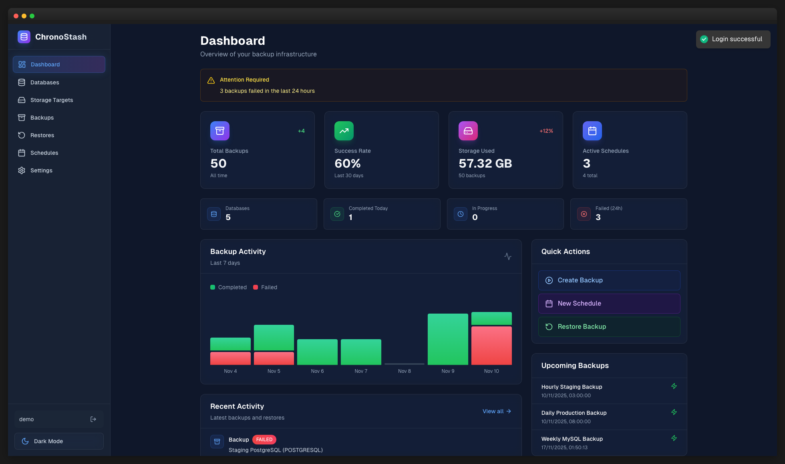
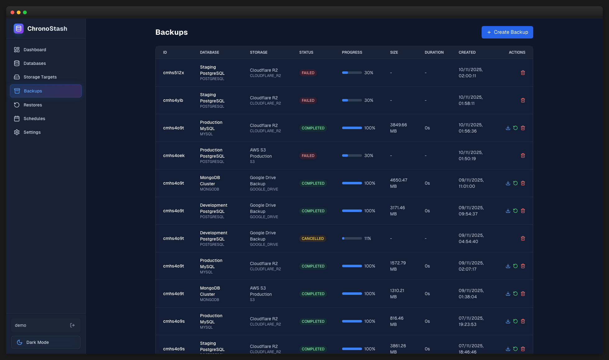
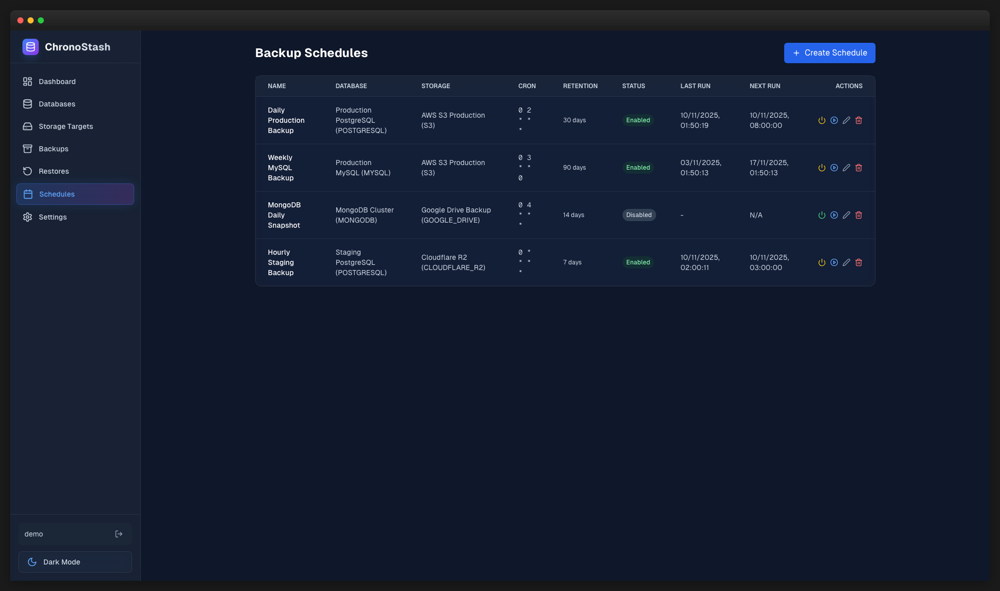
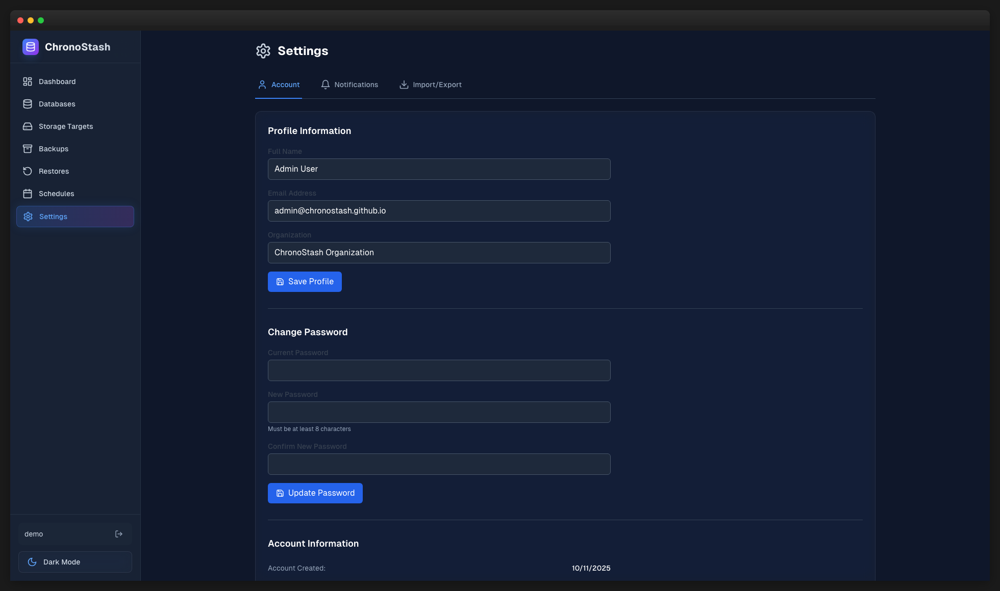

# ChronoStash ⏱️🗄️

> **Time-smart, full-stack database backup & restore platform**

ChronoStash is an open-source platform for dependable database backups across PostgreSQL, MySQL, and MongoDB—with S3-compatible storage (AWS S3, MinIO, Cloudflare R2), cron-based schedules, AES-256-GCM encryption, and real-time progress monitoring.

[](https://www.typescriptlang.org/)
[](https://nodejs.org/)
[](https://reactjs.org/)
[](LICENSE)

**TL;DR**: One UI + API to back up Postgres/MySQL/Mongo to S3/R2/MinIO with cron schedules, encryption (AES-256-GCM), retention, and one-click restores. Runs on your laptop, server, or Kubernetes.



## ✨ Features

### 🎯 Core Features

- **Multi-Database Support** - PostgreSQL, MySQL, MongoDB
- **Flexible Storage** - S3, MinIO, Cloudflare R2, and any S3-compatible storage
- **Automated Scheduling** - Cron-based backup schedules with timezone support
- **Real-time Monitoring** - Live progress updates and job status tracking
- **Backup Encryption** - AES-256-GCM encryption for sensitive data
- **Retention Policies** - Automatic cleanup based on age or count
- **Point-in-Time Restore** - Restore to any previous backup

### 🚀 Advanced Features

- **Job Queue Management** - BullMQ-powered async job processing
- **Notification System** - Slack and Telegram integration
- **RESTful API** - Full-featured API for automation
- **Modern UI** - Clean, responsive React interface
- **Import/Export** - Backup and restore system configurations
- **Activity Dashboard** - Comprehensive analytics and trends

## 📸 Screenshots

<table>
  <tr>
    <td><br/><sub>Dashboard with Analytics</sub></td>
    <td><br/><sub>Backup Management</sub></td>
  </tr>
  <tr>
    <td><br/><sub>Automated Scheduling</sub></td>
    <td><br/><sub>Settings & Notifications</sub></td>
  </tr>
</table>

## 👤 Who is ChronoStash for?

- **Solo devs** needing simple nightly backups
- **Small teams** wanting a UI + API instead of adhoc scripts
- **Platform teams** standardizing backups across services

## 🏗️ Architecture

```
┌─────────────────┐     ┌─────────────────┐     ┌─────────────────┐
│   React SPA     │────▶│  Express API    │────▶│     SQLite      │
│   (Frontend)    │     │   (Backend)     │     │   (Metadata)    │
└─────────────────┘     └─────────────────┘     └─────────────────┘
                               │
                               │
                    ┌──────────┼──────────┐
                    │          │          │
              ┌─────▼────┐ ┌───▼────┐ ┌──▼────────┐
              │  BullMQ  │ │ Redis  │ │  Storage  │
              │  Worker  │ │ Queue  │ │  (S3/R2)  │
              └──────────┘ └────────┘ └───────────┘
```

### Tech Stack

**Frontend**

- React 18 with TypeScript
- TanStack Query for data fetching
- Tailwind CSS for styling
- Vite for build tooling
- Lucide React for icons

**Backend**

- Node.js 20+ with Express
- TypeScript for type safety
- Prisma ORM for database access
- BullMQ for job queue management
- SQLite for metadata storage
- Redis for queue backend

**Storage & Database Engines**

- PostgreSQL engine with `pg_dump` / `pg_restore`
- MySQL engine with `mysqldump` / `mysql`
- MongoDB engine with `mongodump` / `mongorestore`
- S3-compatible storage (AWS S3, MinIO, Cloudflare R2)

## 🚀 Quick Start

### Prerequisites

- **Node.js 20+** (required)
- **pnpm 8+** (required - `npm install -g pnpm`)
- **Redis 7+** (required - for job queue)

### Installation

```bash
# Clone the repository
git clone https://github.com/chronoapps/chronostash.git
cd chronostash

# Install dependencies
pnpm install

# Build shared packages (required first!)
pnpm run build:packages

# Setup environment variables
cp apps/backend/.env.example apps/backend/.env
# Edit apps/backend/.env with your configuration

# Generate Prisma client
cd apps/backend
pnpm prisma:generate

# Run database migrations
pnpm prisma:migrate

# Seed admin user
pnpm seed

# Return to root and start development servers
cd ../..
pnpm run dev
```

**Access the application:**

- **Frontend**: http://localhost:5173
- **Backend**: http://localhost:3001

**Default credentials:**

- Username: `admin`
- Password: `admin123456`

### Environment Configuration

Create `apps/backend/.env`:

```env
# Database (SQLite)
DATABASE_URL="file:./data/chronostash.db"

# Redis (required for BullMQ)
REDIS_URL="redis://localhost:6379"

# JWT Authentication (generate with: openssl rand -base64 32)
JWT_SECRET="your-secret-key-change-this"

# Server
PORT=3001
NODE_ENV=development

# Optional: Backup encryption (generate with: openssl rand -base64 32)
ENCRYPTION_KEY="your-encryption-key"

# Optional: Logging
LOG_LEVEL=info

# Admin user (used by seed script)
ADMIN_USERNAME=admin
ADMIN_PASSWORD=admin123456
```

## 📖 Usage

### 1. Add Storage Target

Before creating backups, configure a storage destination:

1. Navigate to **Storage Targets**
2. Click **Add Storage Target**
3. Select type (S3, Cloudflare R2, MinIO)
4. Enter credentials:
   - Name (e.g., "AWS S3 Production")
   - Bucket name
   - Region
   - Access Key ID
   - Secret Access Key
   - Endpoint (for R2/MinIO)

### 2. Add Database Connection

1. Navigate to **Databases**
2. Click **Add Database**
3. Fill in connection details:
   - Name (e.g., "Production PostgreSQL")
   - Engine (PostgreSQL, MySQL, or MongoDB)
   - Host, Port, Username, Password
   - Database name (optional - leave empty to backup all databases)
   - SSL mode (disable, require, prefer, verify-ca, verify-full)

### 3. Create Backup

**Manual Backup:**

1. Navigate to **Backups**
2. Click **Create Backup**
3. Select database and storage target
4. Click **Create Backup**
5. Monitor progress in real-time

**Scheduled Backup:**

1. Navigate to **Schedules**
2. Click **Create Schedule**
3. Configure:
   - Schedule name
   - Database and storage target
   - Cron expression (e.g., `0 2 * * *` for daily at 2 AM)
   - Timezone
   - Retention days (automatic cleanup)
4. Enable schedule

### 4. Restore Backup

1. Navigate to **Backups**
2. Find the backup to restore
3. Click **Restore**
4. Configure target (optional):
   - Target host (default: original database)
   - Target database name
   - Drop existing data option
5. Click **Start Restore**
6. Monitor progress

### 5. Setup Notifications

1. Navigate to **Settings** → **Notifications**
2. Configure Slack or Telegram:
   - **Slack**: Webhook URL, channel, username
   - **Telegram**: Bot token, chat ID
3. Test notification
4. Enable success/failure notifications

## 🔌 API Documentation

### Authentication

```bash
# Login
curl -X POST http://localhost:3001/api/auth/login \
  -H "Content-Type: application/json" \
  -d '{"username": "admin", "password": "admin123456"}'

# Returns: { "token": "jwt-token", "user": {...} }
```

### Backups

```bash
# List backups
curl http://localhost:3001/api/backups \
  -H "Authorization: Bearer <token>"

# Create backup
curl -X POST http://localhost:3001/api/backups \
  -H "Authorization: Bearer <token>" \
  -H "Content-Type: application/json" \
  -d '{"databaseId": "db-id", "storageId": "storage-id"}'

# Get backup status
curl http://localhost:3001/api/backups/:id \
  -H "Authorization: Bearer <token>"

# Download backup
curl http://localhost:3001/api/backups/:id/download \
  -H "Authorization: Bearer <token>" \
  -o backup.dump
```

### Schedules

```bash
# Create schedule
curl -X POST http://localhost:3001/api/schedules \
  -H "Authorization: Bearer <token>" \
  -H "Content-Type: application/json" \
  -d '{
    "name": "Daily Backup",
    "databaseId": "db-id",
    "storageId": "storage-id",
    "cronExpression": "0 2 * * *",
    "timezone": "UTC",
    "retentionDays": 30,
    "enabled": true
  }'

# Toggle schedule
curl -X PATCH http://localhost:3001/api/schedules/:id/toggle \
  -H "Authorization: Bearer <token>"

# Run schedule immediately
curl -X POST http://localhost:3001/api/schedules/:id/run \
  -H "Authorization: Bearer <token>"
```

## 🛠️ Development

### Project Structure

```
chronostash/
├── apps/
│   ├── backend/              # Express API server
│   │   ├── src/
│   │   │   ├── routes/       # API endpoints
│   │   │   ├── jobs/         # BullMQ job handlers
│   │   │   ├── services/     # Business logic
│   │   │   └── middleware/   # Auth, validation
│   │   └── prisma/           # Schema, migrations, seeders
│   └── frontend/             # React SPA
│       └── src/
│           ├── pages/        # Route-level components
│           ├── components/   # Reusable UI components
│           ├── contexts/     # React Context (auth, etc.)
│           └── lib/          # API client, utilities
├── packages/
│   ├── database-engines/     # DB backup/restore implementations
│   ├── storage-adapters/     # Storage backend implementations
│   └── shared/               # Shared types & utilities
└── pnpm-workspace.yaml       # pnpm monorepo config
```

### Available Commands

```bash
# Development
pnpm run dev                  # Start both frontend and backend
pnpm --filter @chronostash/backend dev    # Backend only
pnpm --filter @chronostash/frontend dev   # Frontend only

# Building
pnpm run build                # Build all packages and apps
pnpm run build:packages       # Build shared packages only

# Database
cd apps/backend
pnpm prisma:generate          # Generate Prisma client
pnpm prisma:migrate           # Run migrations
pnpm prisma:studio            # Open Prisma Studio GUI

# Seeding
pnpm seed                     # Seed admin user
pnpm seed:demo                # Seed demo data (35 days of mock backups)

# Testing
pnpm test                     # Run all tests
pnpm test:watch               # Run tests in watch mode
pnpm test:coverage            # Run with coverage

# Type checking & linting
pnpm run type-check           # TypeScript check all packages
pnpm run lint                 # Lint all packages
```

### Adding a New Database Engine

1. Create `packages/database-engines/src/my-engine.ts`:

```typescript
import { DatabaseEngine, BackupConfig, RestoreConfig } from "./interface"

export class MyDBEngine implements DatabaseEngine {
  async backup(config: BackupConfig): Promise<{ path: string; size: number }> {
    // Implement using database CLI tools (spawn child process)
  }

  async restore(config: RestoreConfig): Promise<void> {
    // Implement restore logic
  }
}
```

2. Register in `packages/database-engines/src/index.ts`
3. Add enum to `packages/shared/src/types/index.ts`
4. Rebuild: `pnpm run build:packages`

### Adding a New Storage Backend

1. Create `packages/storage-adapters/src/my-adapter.ts`:

```typescript
import { StorageAdapter } from "./interface"

export class MyStorageAdapter implements StorageAdapter {
  async upload(stream: ReadStream, path: string): Promise<{ url: string }> {
    // Implement upload logic
  }

  async download(path: string): Promise<ReadStream> {
    // Implement download logic
  }

  async delete(path: string): Promise<void> {
    // Implement deletion
  }
}
```

2. Register in `packages/storage-adapters/src/index.ts`
3. Add enum to `packages/shared/src/types/index.ts`
4. Rebuild: `pnpm run build:packages`

## 🧪 Testing

```bash
# Run all tests
pnpm test

# Run specific test file
pnpm test -- backup-service.test.ts

# Run with coverage
pnpm test:coverage

# Run in watch mode
pnpm test:watch
```

## 🤝 Contributing

We welcome contributions! Here's how to get started:

### Development Workflow

1. Fork the repository
2. Clone your fork: `git clone https://github.com/YOUR_USERNAME/chronostash.git`
3. Create a feature branch: `git checkout -b feature/amazing-feature`
4. Install dependencies: `pnpm install`
5. Build packages: `pnpm run build:packages`
6. Make your changes
7. Run tests: `pnpm test`
8. Run type checking: `pnpm run type-check`
9. Run linting: `pnpm run lint`
10. Commit: `git commit -m 'feat: add amazing feature'`
11. Push: `git push origin feature/amazing-feature`
12. Open a Pull Request

### Code Style

- **TypeScript** for all code
- **ESLint + Prettier** for formatting
- **Conventional Commits** for commit messages (`feat:`, `fix:`, `docs:`, etc.)
- **Test coverage** for new features
- **Type safety** - avoid `any`, use proper types

### Commit Message Format

```
<type>: <description>

[optional body]

[optional footer]
```

Types: `feat`, `fix`, `docs`, `style`, `refactor`, `test`, `chore`

Examples:

- `feat: add MongoDB connection pooling`
- `fix: handle null backup size correctly`
- `docs: update API documentation`

See [CONTRIBUTING.md](CONTRIBUTING.md) for detailed guidelines.

## 📚 Documentation

- **[Secured Databases](docs/SECURED_DATABASES.md)** - Connect to RDS, Azure, GCP, Kubernetes
- **[Contributing Guide](CONTRIBUTING.md)** - Development guidelines
- **[Changelog](CHANGELOG.md)** - Version history

## 📄 License

This project is licensed under the MIT License - see the [LICENSE](LICENSE) file for details.

## 🙏 Acknowledgments

Built with these amazing open-source projects:

- [Prisma](https://www.prisma.io/) - Next-generation ORM
- [BullMQ](https://docs.bullmq.io/) - Reliable job queue
- [TanStack Query](https://tanstack.com/query) - Powerful data fetching
- [Tailwind CSS](https://tailwindcss.com/) - Utility-first CSS
- [Vite](https://vitejs.dev/) - Fast build tool
- [Express](https://expressjs.com/) - Web framework

## 📞 Support

- **Issues**: [GitHub Issues](https://github.com/chronoapps/chronostash/issues)
- **Discussions**: [GitHub Discussions](https://github.com/chronoapps/chronostash/discussions)

## 🗺️ Roadmap

- [ ] Support for additional databases (Redis, Cassandra, MariaDB)
- [ ] Backup compression options (gzip, zstd, lz4)
- [ ] Incremental backups
- [ ] Multi-tenancy support
- [ ] Webhook notifications
- [ ] Backup verification and testing
- [ ] Database migration tools
- [ ] CLI tool for automation
- [ ] Docker Compose deployment option
- [ ] Kubernetes operator
- [ ] Email notifications

## ❓ FAQ

**Q: Is telemetry collected?**
A: No. ChronoStash is 100% self-hosted. We do not phone home.

**Q: How big are backup files?**
A: Depends on DB + compression. Compression options (gzip/zstd/lz4) are on the roadmap.

## ⭐ Star History

If you find ChronoStash useful, please consider giving it a star!

---
